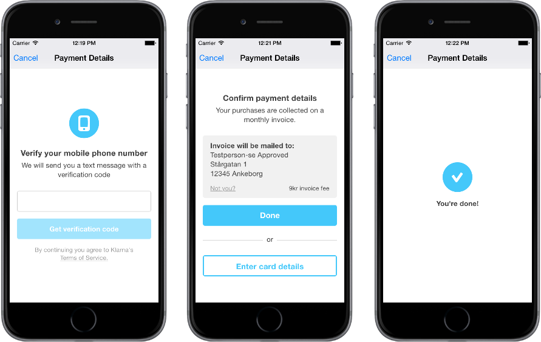

# Klarna on Demand

Klarna on-demand allows you to integrate Klarna's payment solution in mobile apps that offer on demand services. It's a perfect fit for apps selling concert tickets, taxi rides, food pick-ups, etc.

This project contains Klarna's on-demand payment solution SDK for iOS 8+, as well as a sample application utilizing the SDK.

While not necessary, the simplest way to get going with both the sample application and the SDK is to use [CocoaPods](http://cocoapods.org) and so all the following instructions will focus on that approach. For an alternative approach, see the [official documentation (coming soon)](http://developers.klarna.com).

## Using the SDK
Have a look at the [integration guide](doc/integration.md) for full details on how to use our SDK in your application.

For a short overview of the recent changes, please check out the project's [changelog](https://github.com/klarna/klarna-on-demand-ios/blob/master/CHANGELOG.md).
## Running the sample application
Assuming you've cloned the repository, simply cd into the repo, open *KlarnaOnDemand.xcworkspace* and run the *KlarnaOnDemandExample* project.

**Note:** While this will get the application up and running, you will not be able to successfully perform purchases without a backend for the application to interact with. You should go [here](https://github.com/klarna/sample-ondemand-backend) and follow the instructions provided to get a sample backend running on your local machine.

## Contributing
You'd like to help us out? That's great! Here's what you need to do in order to contribute.

### Prerequisites
You'll need to install [CocoaPods](http://cocoapods.org) in order to properly work on the project. Assuming you have [Ruby](https://www.ruby-lang.org/en/downloads/) installed, all you need to do is type this into your terminal:

    gem install cocoapods

### Setup

1. Fork the project and clone your repository
2. In the project folder, run `pod install`
3. Open KlarnaOnDemand.xcworkspace and code away

### Tests
Pull requests must include tests for their proposed fixes/functionality. We use [Kiwi](https://github.com/kiwi-bdd/Kiwi) to write our tests and you can find the tests themselves under the *KlarnaOnDemand* project in the *KlarnaOnDemandTests* folder.

## License
Klarna on Demand is available under the Apache 2.0 license. See the [LICENSE](./LICENSE) file for more info.
